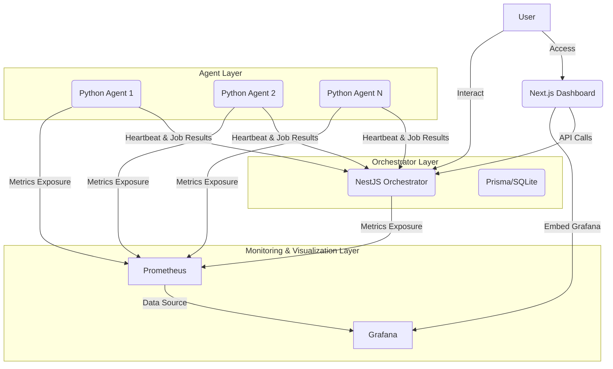

# Copyright (c) 2025 Saeed Alaediny
# MAMOS Architecture Overview

This document provides an overview of the MAMOS (Manus Agent Management & Orchestration System) architecture.

## 1. System Layers

MAMOS is composed of three main layers:

*   **Orchestrator Layer**: The central brain, responsible for agent management, job orchestration, and API services.
*   **Agent Layer**: Lightweight clients deployed on target machines, executing tasks and reporting status.
*   **Monitoring & Visualization Layer**: Collects metrics and provides dashboards for system health and performance.

## 2. Component Diagram

## 3. Data Flow

*   **Agent Registration**: Agents register with the Orchestrator using one-time tokens.
*   **Heartbeats**: Agents send periodic heartbeats and system metrics to the Orchestrator.
*   **Job Execution**: Orchestrator dispatches jobs to agents. Agents execute commands and report results.
*   **Metrics Collection**: Prometheus scrapes metrics from the Orchestrator and Agents.
*   **Visualization**: Grafana queries Prometheus to display real-time dashboards.

## 4. Technologies Used

| Component       | Technology Stack         | Description                                    |
| :-------------- | :----------------------- | :--------------------------------------------- |
| Orchestrator    | NestJS, TypeScript, Prisma | Backend API, Agent Management, Job Queue       |
| Agent           | Python, Typer, Requests  | Lightweight client, command execution, metrics |
| Dashboard       | Next.js, React, TailwindCSS| Web UI for monitoring and control              |
| Database        | SQLite (for MVP)         | Persistent storage for Orchestrator            |
| Monitoring      | Prometheus, Grafana      | Metrics collection and visualization           |
| Containerization| Docker, Docker Compose   | Development and deployment                     |

---

**Note:** This is a stub. More detailed architectural decisions, component interactions, and design patterns will be added here as the project evolves.
