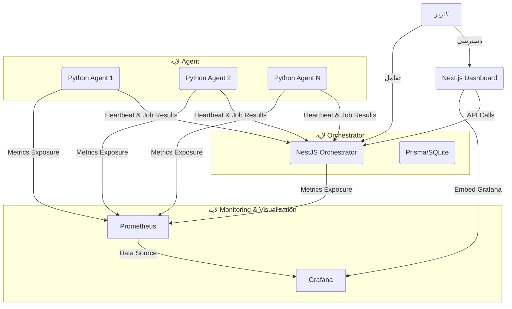

# گزارش فنی پروژه MAMOS - فاز 1 (MVP)

**نویسنده:** Manus AI
**تاریخ:** 14 اکتبر 2025

## 1. مقدمه

این گزارش فنی، جزئیات پیاده‌سازی فاز 1 (MVP) پروژه MAMOS (Manus Agent Management & Orchestration System) را ارائه می‌دهد. MAMOS یک پلتفرم هوشمند برای مدیریت و ارکستراسیون Agentهای توزیع‌شده، خودکارسازی وظایف و ردیابی چرخه حیات پروژه از ایده تا پروداکشن است. فاز 1 بر ایجاد اجزای اصلی و یکپارچه‌سازی آن‌ها در ساختار monorepo موجود `aladdin-sandbox` تمرکز دارد.

## 2. معماری سیستم

معماری MAMOS در فاز 1 شامل سه لایه اصلی است که به صورت ماژولار طراحی شده‌اند تا امکان توسعه و مقیاس‌پذیری در آینده فراهم باشد. این لایه‌ها عبارتند از:

*   **لایه Orchestrator**: مغز مرکزی سیستم که مسئول مدیریت Agentها، ارکستراسیون وظایف و ارائه سرویس‌های API است.
*   **لایه Agent**: کلاینت‌های سبک‌وزن که بر روی ماشین‌های هدف مستقر می‌شوند و وظایف را اجرا کرده و وضعیت خود را گزارش می‌دهند.
*   **لایه Monitoring & Visualization**: مسئول جمع‌آوری معیارهای عملکردی و ارائه داشبوردهای بصری برای نمایش وضعیت سلامت و عملکرد سیستم.

### 2.1. نمودار معماری



### 2.2. جریان داده (Data Flow)

1.  **ثبت Agent**: Agentها با استفاده از توکن‌های یک‌بار مصرف در Orchestrator ثبت نام می‌کنند.
2.  **Heartbeats**: Agentها به صورت دوره‌ای Heartbeat و معیارهای سیستمی را به Orchestrator ارسال می‌کنند.
3.  **اجرای وظایف**: Orchestrator وظایف را به Agentها ارسال می‌کند. Agentها دستورات را اجرا کرده و نتایج را گزارش می‌دهند.
4.  **جمع‌آوری معیارها**: Prometheus معیارهای عملکردی را از Orchestrator و Agentها جمع‌آوری می‌کند.
5.  **بصری‌سازی**: Grafana با کوئری زدن از Prometheus، داشبوردهای Real-time را نمایش می‌دهد.

## 3. اجزای پروژه و جزئیات پیاده‌سازی

پروژه MAMOS در `aladdin-sandbox` به صورت زیر سازماندهی شده است:

```
aladdin-sandbox/
├── apps/
│   ├── backend/
│   │   └── mamos/           # NestJS Orchestrator
│   ├── frontend/
│   │   └── mamos/           # Next.js Dashboard
│   └── agent/
│       └── mamos/           # Python Agent
├── infra/
│   ├── docker/
│   │   └── mamos/           # Docker Compose files
│   ├── grafana/             # Grafana provisioning
│   └── prometheus/          # Prometheus configuration
├── .github/workflows/       # CI/CD workflows
├── scripts/                 # Installation scripts
└── docs/                    # Documentation
```

### 3.1. Orchestrator (NestJS)

*   **مکان**: `apps/backend/mamos`
*   **تکنولوژی**: NestJS (Node.js, TypeScript), Prisma ORM, SQLite (برای MVP), JWT برای احراز هویت.
*   **قابلیت‌ها**:
    *   **مدیریت Agent**: ثبت نام Agentها، ردیابی وضعیت (آنلاین/آفلاین) و Heartbeat.
    *   **ارکستراسیون وظایف**: ایجاد، زمان‌بندی و توزیع وظایف به Agentها. ردیابی وضعیت اجرای وظایف (در حال اجرا، تکمیل شده، خطا).
    *   **API RESTful**: برای تعامل Dashboard و Agentها.
    *   **WebSocket**: برای به‌روزرسانی‌های Real-time وضعیت Agentها و وظایف.
    *   **Prometheus Metrics**: اکسپوز کردن Endpoint `/metrics` برای جمع‌آوری معیارهای عملکردی Orchestrator.
    *   **Command Whitelisting**: لیست سفید دستورات مجاز برای اجرا توسط Agentها.

### 3.2. Agent (Python)

*   **مکان**: `apps/agent/mamos`
*   **تکنولوژی**: Python 3.11+, Typer (برای CLI), Requests (برای ارتباط HTTP), Websockets (برای ارتباط Real-time), psutil (برای جمع‌آوری اطلاعات سیستم), Prometheus Client (برای اکسپوز کردن Metrics).
*   **قابلیت‌ها**:
    *   **ثبت نام**: ثبت نام امن با Orchestrator با استفاده از توکن‌های یک‌بار مصرف.
    *   **Heartbeat**: ارسال دوره‌ای اطلاعات سیستمی (CPU, RAM, Disk) و وضعیت به Orchestrator.
    *   **اجرای دستورات**: دریافت وظایف از Orchestrator و اجرای دستورات Whitelist شده به صورت امن.
    *   **گزارش نتایج**: ارسال نتایج اجرای دستورات و لاگ‌ها به Orchestrator.
    *   **Prometheus Metrics**: اکسپوز کردن Endpoint `/metrics` برای جمع‌آوری معیارهای عملکردی Agent (مانند CPU, RAM, تعداد وظایف اجرا شده).

### 3.3. Dashboard (Next.js)

*   **مکان**: `apps/frontend/mamos`
*   **تکنولوژی**: Next.js 14 (React), Tailwind CSS, shadcn/ui (برای کامپوننت‌های UI).
*   **قابلیت‌ها**:
    *   **احراز هویت**: صفحه ورود (Login) با Mock Authentication برای MVP.
    *   **نمایش وضعیت کلی**: نمایش تعداد Agentهای فعال، وظایف در حال اجرا و وضعیت سلامت سیستم.
    *   **لیست Agentها**: نمایش Agentهای ثبت شده با جزئیات (Hostname, OS, وضعیت, CPU, RAM).
    *   **لیست وظایف**: نمایش وظایف اخیر با جزئیات (دستور، وضعیت، خروجی).
    *   **یکپارچگی با Grafana**: امکان نمایش داشبوردهای Grafana (از طریق iframe یا لینک) برای بصری‌سازی پیشرفته‌تر.

### 3.4. Monitoring (Prometheus + Grafana)

*   **مکان**: `infra/prometheus/` و `infra/grafana/`
*   **تکنولوژی**: Prometheus (برای جمع‌آوری Metrics), Grafana (برای بصری‌سازی).
*   **قابلیت‌ها**:
    *   **Prometheus**: پیکربندی شده برای جمع‌آوری Metrics از Orchestrator (پورت 4000) و Agentها (پورت 9101).
    *   **Grafana**: پیکربندی شده با Datasource Prometheus و یک داشبورد اولیه (MAMOS Overview) برای نمایش معیارهای کلیدی سیستم.

### 3.5. زیرساخت Docker

*   **مکان**: `infra/docker/mamos/`
*   **تکنولوژی**: Docker, Docker Compose.
*   **قابلیت‌ها**:
    *   **`docker-compose.dev.yml`**: فایل Docker Compose برای راه‌اندازی تمام سرویس‌های MAMOS (Orchestrator, Dashboard, Prometheus, Grafana) در محیط توسعه.
    *   **Dockerfileها**: Dockerfileهای مجزا برای Orchestrator (Node.js) و Dashboard (Next.js) برای ساخت ایمیج‌های کانتینر.

### 3.6. اسکریپت‌های نصب

*   **مکان**: `scripts/`
*   **قابلیت‌ها**:
    *   **`install_linux.sh`**: اسکریپت Shell برای نصب Docker و Docker Compose (در صورت نیاز)، ایجاد فایل `.env` و راه‌اندازی تمام سرویس‌های MAMOS بر روی سیستم‌عامل Linux.
    *   **`install_agent.sh`**: اسکریپت Shell برای نصب Agent پایتون، وابستگی‌ها و ایجاد فایل پیکربندی اولیه.

### 3.7. CI/CD Workflows

*   **مکان**: `.github/workflows/`
*   **قابلیت‌ها**:
    *   **`ci.yml`**: یک Workflow اولیه GitHub Actions برای تست و Build اجزای Orchestrator، Dashboard و Agent در هر Push یا Pull Request.

## 4. راهنمای استفاده و استقرار

برای جزئیات کامل در مورد نحوه استقرار، پیکربندی و استفاده از MAMOS، لطفاً به مستندات زیر مراجعه کنید:

*   **`README.md`**: راهنمای شروع سریع و ادغام با `aladdin-sandbox`.
*   **`docs/ARCHITECTURE.md`**: جزئیات بیشتر در مورد معماری سیستم.
*   **`docs/DEPLOYMENT.md`**: راهنمای گام به گام استقرار MAMOS.
*   **`docs/AGENT.md`**: راهنمای کامل نصب و پیکربندی Agent.
*   **`docs/SECURITY.md`**: ملاحظات امنیتی و بهترین شیوه‌ها.

## 5. معیارهای پذیرش (Acceptance Criteria) - فاز 1 MVP

*   ✅ Docker Compose تمام سرویس‌ها (Orchestrator, Dashboard, Prometheus, Grafana) را با موفقیت راه‌اندازی می‌کند.
*   ✅ Dashboard از طریق `http://localhost:3000` قابل دسترسی است و قابلیت ورود (Mock Login) را دارد.
*   ✅ Orchestrator API از طریق `http://localhost:4000` قابل دسترسی است.
*   ✅ Prometheus از طریق `http://localhost:9090` قابل دسترسی است.
*   ✅ Grafana از طریق `http://localhost:3001` قابل دسترسی است و داشبورد `MAMOS Overview` را نمایش می‌دهد.
*   ✅ Agent پایتون قابل نصب و اجرا است، با Orchestrator ثبت نام می‌کند، Heartbeat ارسال می‌کند و دستورات Whitelist شده را اجرا می‌کند.
*   ✅ Workflow مربوط به CI (`.github/workflows/ci.yml`) برای تست اولیه اجزا تنظیم شده و کار می‌کند.

## 6. نتیجه‌گیری

فاز 1 پروژه MAMOS یک پایه قوی برای توسعه‌های آینده فراهم می‌کند. با این MVP، شما یک سیستم عامل کامل برای مدیریت Agentها، ارکستراسیون وظایف و نظارت بر عملکرد سیستم خواهید داشت که به صورت ماژولار و قابل توسعه طراحی شده است. این ساختار به شما امکان می‌دهد تا به راحتی ویژگی‌های جدید را اضافه کرده و سیستم را بر اساس نیازهای خود مقیاس‌بندی کنید.

---
